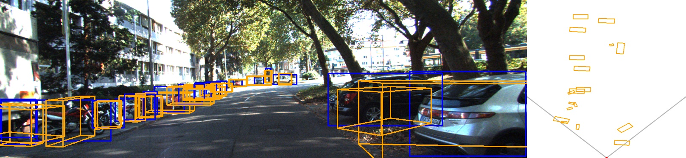
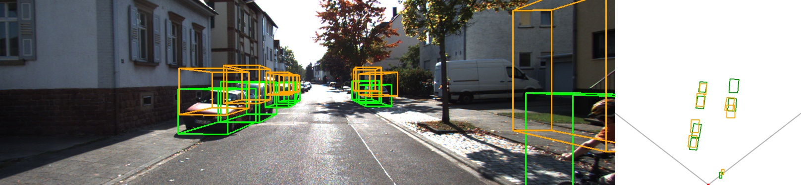

# 3D Object Detection (Monocular + BEV)

카메라 한 대로 3D 박스를 예측하고, 좌측은 이미지·우측은 BEV(탑뷰)로 시각화  
훈련은 KITTI **3d Object**, 추론은 **카메라만** 사용

> 
> 나름 괜찮은 것 같기도 한데… **BEV를 보면 객체들이 춤을 추는중...**.

---

## 핵심 아이디어

- **Two-Stage 파이프라인**
  1) 2D Detector: 이미지에서 ROI(2D 박스) 추출  
  2) 3D Head: ROI(128×128)만 보고 `dims_res, logZ, yaw(sin,cos)` 회귀  
  3) 복원/렌더: `uv=(bbox_center_x, bottom_y)`와 `P2`로 (X,Y,Z) 복원 → 이미지/BEV에 3D 박스 시각화
- **데이터셋**
  - KITTI **Object**: train/val 학습, testing 단일 프레임 추론
  - KITTI **Tracking**: 프레임을 이어 GIF/MP4 영상 생성

---

## 결과 예시

- 이미지 + BEV (val 샘플)  
  

- KITTI Object testing (단일 프레임)  
  

- KITTI Tracking (GIF)  
  

---

## 폴더/에셋(예시)
- `datasets/kitti_object/{training,testing}`  
- `datasets/KITTI_Tracking/{training,testing}`  
- `models/mono3d_baseline.pt` (3D head 가중치)  

---

## 메모
- 이후 Sensor Fusion으로 확장해서 보완
