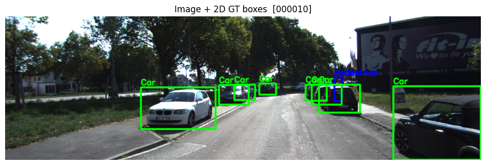
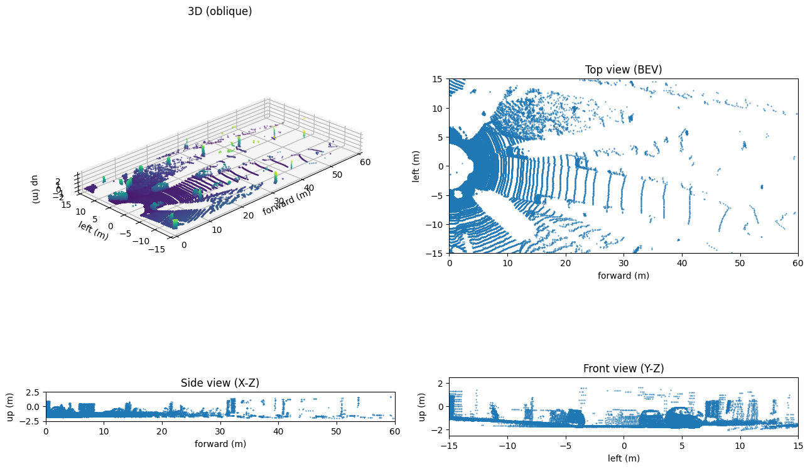
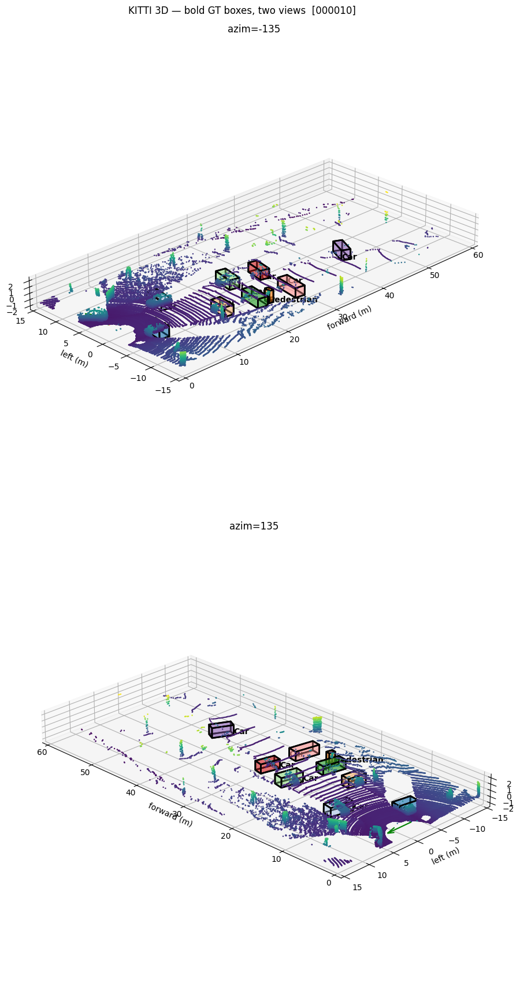
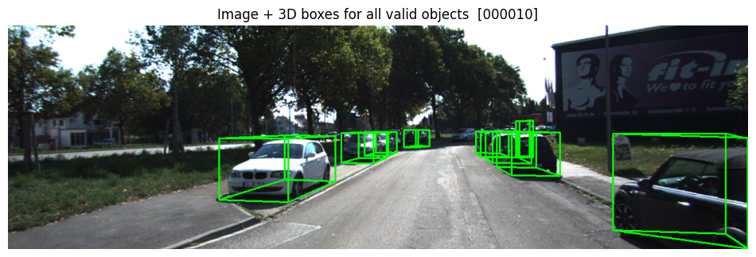

# KITTI 3D Visualization

KITTI Object Detection 데이터셋을 이용해 **이미지 / LiDAR / 3D 박스**를 시각화한 프로젝트.

---

## 진행 내용
- **Image + 2D GT**
  - RGB 이미지에 2D Ground Truth 박스를 굵고 선명하게 표시
  - 객체 종류별 색상 구분 (Car, Pedestrian, Cyclist 등)

- **LiDAR 멀티뷰**
  - 3D(사선), BEV(탑뷰), Side(X–Z), Front(Y–Z) 시점에서 포인트 클라우드 표시
  - ROI 설정, 다운샘플링 적용으로 가시성 개선

- **3D GT Boxes (LiDAR 공간)**
  - `forward/left/up` 좌표계에서 굵고 진하게 렌더
  - 두 가지 시점(azim -135°, +135°)에서 비교

- **Image + 3D Projection**
  - 3D Bounding Box를 카메라 이미지에 투영해 시각화
  - 모든 객체에 대해 3D가 유효하면 3D 박스, 아니면 2D 박스 표시

---

## 결과 예시
### Image + 2D GT

### LiDAR Multi-View

### 3D GT Boxes (Two Views)

### Image + Projected 3D Boxes

---

## 데이터셋
- **KITTI Object Detection**
  - `image_2/` : RGB 이미지
  - `label_2/` : 2D & 3D 라벨
  - `velodyne/` : LiDAR 포인트 클라우드
  - `calib/` : 카메라-라이다 캘리브레이션 정보

---

## 메모
- KITTI는 카메라 좌표계 정의가 중요 (h, w, l 순서, bottom center 기준)
- 3D 박스 크기 오차는 캘리브레이션 매트릭스 적용 여부와 좌표계 정의 차이에서 발생
- BEV 시각화는 추후 BEV Detection / Segmentation 실험에 활용 가능