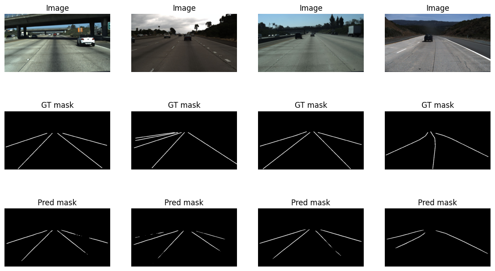
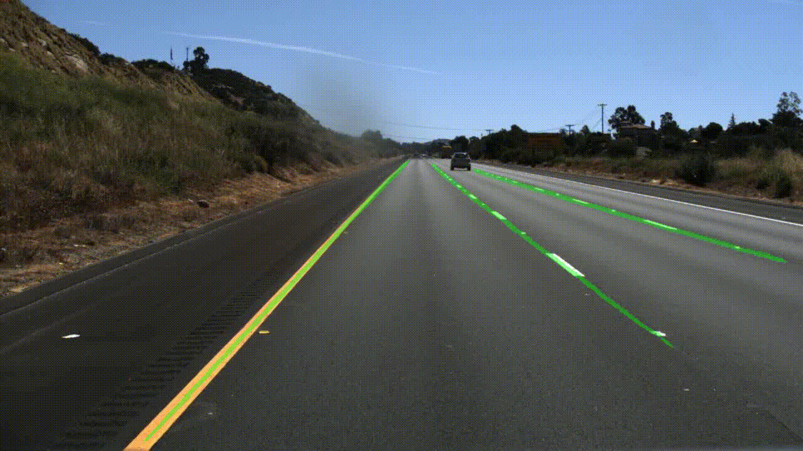

# Lane Detection (OpenCV + U-Net)

TuSimple 데이터셋으로 간단히 차선 인식을 해본 프로젝트.

---

## 진행 내용
- **OpenCV**: Canny + ROI + HoughLinesP 방식으로 구현  
  → 파라미터를 많이 바꿔도 그림자, 마모, 곡선 차선에서 잘 안 잡힘.
- **U-Net**: 기본 구조만 가져와서 학습  
  → 학습량 적어도 안정적으로 차선 마스크 출력.

---

## 결과 예시
### OpenCV

### U-Net

> U-Net 추론 영상 (test set, 20fps)
> 

---

## 데이터셋
- TuSimple (train/test/label JSON)
- 테스트는 `test_set/clips/0530/...` 클립 사용

---

## 코드
- `LaneDetection_OpenCV.ipynb` → OpenCV 기반  
- `LaneDetection_UNet.ipynb` → PyTorch U-Net 기반

---

## 메모
- 규칙 기반(OpenCV)은 장면별 튜닝이 필요해서 실제 주행엔 부적합  
- 딥러닝(U-Net)은 데이터/모델만 맞추면 꽤 괜찮은 결과  
- 다음엔 LaneNet이나 UFLD 같이 경량 모델로도 테스트 예정
