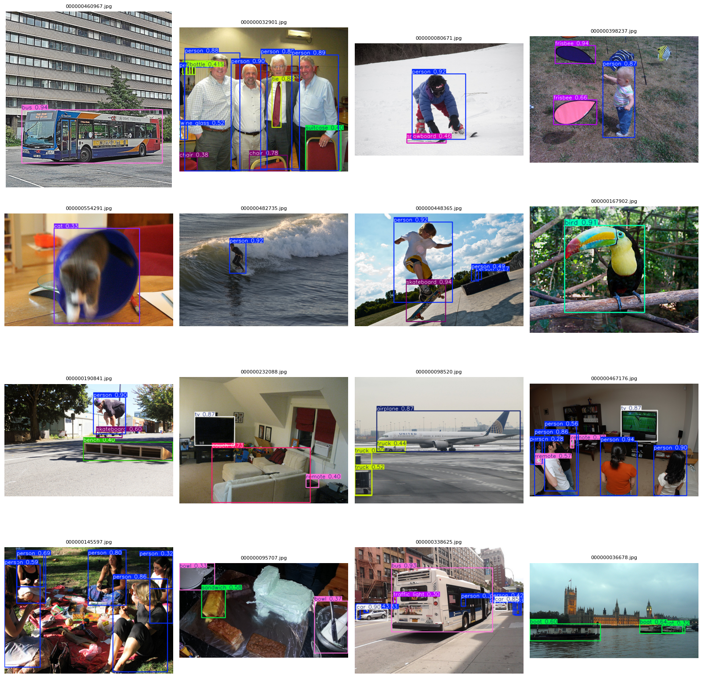

# COCO Object Detection (YOLO)

COCO 2017 데이터셋을 YOLO 형식으로 변환하여 객체 탐지를 수행한 프로젝트.

---

## 진행 내용
- **데이터셋 변환**
  - COCO 원본은 `train2017`, `val2017`, `test2017` 이미지 폴더와 `annotations` JSON 형식 라벨 제공
  - YOLO 학습용 구조(`images/`, `labels/`)로 변환 필요
  - 변환 과정에서:
    - `images/train2017`, `images/val2017`, `images/test2017`로 이미지 정리
    - `labels/train2017`, `labels/val2017`에 YOLO 형식(`.txt`) 라벨 매칭
    - `data.yaml`에 경로 지정 후 학습 가능하도록 구성
  - 변환 과정에서 경로 문제, 라벨 누락, background 처리 등 삽질 다수 🤦‍♂️

- **YOLO 학습**
  - 프레임워크: **Ultralytics YOLO**
  - 주요 설정: `imgsz=640`, `batch=32`, `conf=0.25`, `iou=0.7`
  - AMP 적용으로 학습 속도 개선
  - 학습 후 val 데이터셋에서 성능 검증

---

## 결과 예시
### Validation Set Predictions

---

## 데이터셋
- **COCO 2017**
- 이미지: `images/train2017`, `images/val2017`, `images/test2017`
- 라벨: `labels/train2017`, `labels/val2017`

---

## 코드
- `yolo_train.py` → YOLO 학습 스크립트  
- `yolo_infer.py` → 샘플 이미지 추론 및 시각화 코드

---

## 메모
- COCO → YOLO 변환에서 경로 설정이 가장 까다로움
- 라벨과 이미지 개수가 정확히 맞아야 학습 가능
- YOLO는 라벨이 없는 이미지는 자동으로 background 처리
- 변환만 잘 끝나면 다양한 모델 아키텍처로 빠르게 실험 가능