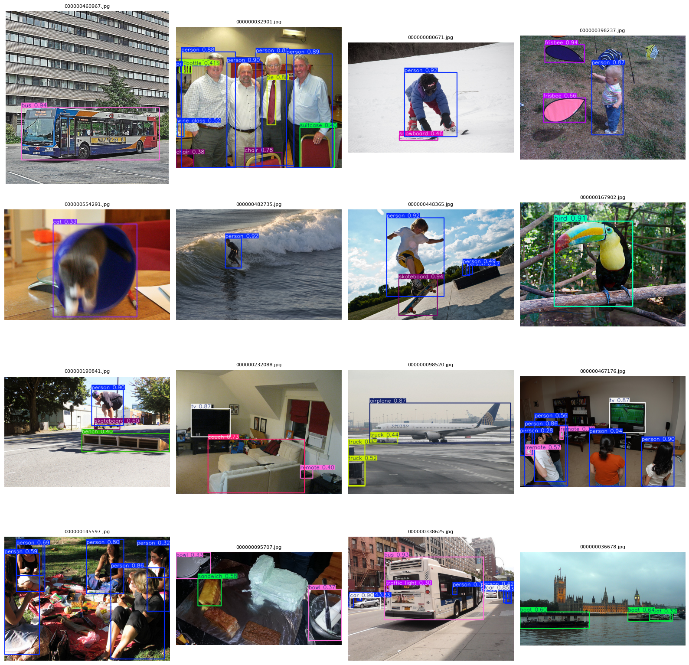
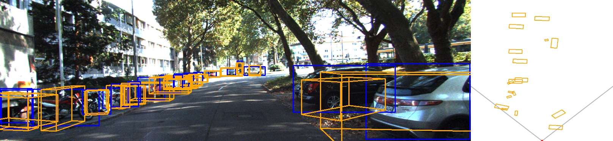
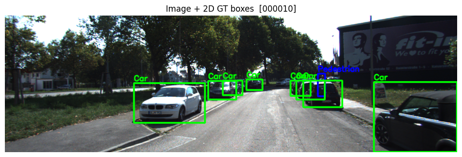

# 자율주행 미니 프로젝트 모음

이 레포지토리는 자율주행의 여러 핵심 기능을 개별 프로젝트 형태로 정리한 모음집입니다. 차선 인식, 객체 검출, 객체 추적, 단일 카메라 3D 객체 검출, LiDAR/3D 시각화 등 다양한 주제를 다룹니다. 각 폴더에는 Jupyter 노트북/파이썬 스크립트, 데이터 처리 코드, 결과 이미지·영상, 상세 설명(README)이 포함되어 있습니다. 아래는 각 하위 프로젝트의 개요입니다.

## 폴더 구조

| 폴더 | 설명 |
| --- | --- |
| **LaneDetection/** | TuSimple 데이터셋을 기반으로 한 차선 인식. OpenCV 기반 방법과 U‑Net 기반 딥러닝 방법을 비교합니다. |
| **ObjectDetection/** | COCO 2017 데이터셋을 YOLO 형식으로 변환하여 Ultralytics YOLO로 학습/추론하는 객체 검출 프로젝트. |
| **ObjectTracking/** | KITTI Tracking 데이터셋에서 검출(YOLO)–추적(SORT/CMC)–평가(MOTA/IDF1) 전체 파이프라인 구현. |
| **3DObjectDetection/** | 단일 카메라에서 3D bounding box를 예측하고 BEV(top‑view)로 시각화하는 두 단계 파이프라인. |
| **3DVisualizaion/** | KITTI Object Detection 데이터셋의 LiDAR 포인트 클라우드와 3D 라벨을 다양한 시점에서 시각화. |

## Lane Detection (차선 인식)

TuSimple 데이터셋으로 차선을 인식하는 두 가지 방식을 실험했습니다. OpenCV 파이프라인(Canny + ROI + HoughLinesP)은 그림자나 곡선에서 취약했고, U‑Net 기반 딥러닝 방법은 적은 학습량으로도 안정적으로 차선 마스크를 출력했습니다:contentReference[oaicite:0]{index=0}. 차선 인식 결과는 아래와 같습니다.

또한 U‑Net 모델의 추론 영상을 GIF로 확인할 수 있습니다.

데이터는 TuSimple(train/test/label JSON)이고, `LaneDetection_OpenCV.ipynb`와 `LaneDetection_UNet.ipynb`에서 구현을 확인할 수 있습니다:contentReference[oaicite:1]{index=1}. 규칙 기반(OpenCV)은 장면별 파라미터 튜닝이 필요해 실제 주행에는 부적합하며, 딥러닝(U‑Net)은 데이터와 모델만 맞추면 더 나은 성능을 보였습니다:contentReference[oaicite:2]{index=2}.

## Object Detection (객체 검출)

COCO 2017 데이터셋의 원본 구조는 `train2017/`, `val2017/`, `test2017/` 이미지 폴더와 `annotations` JSON 라벨로 구성되어 있습니다. 이를 YOLO 학습 형식(`images/`, `labels/`)으로 변환해 `data.yaml`을 설정하여 학습 가능한 구조를 만들었습니다:contentReference[oaicite:3]{index=3}. Ultralytics YOLO 프레임워크를 사용해 `imgsz=640`, `batch=32`, `conf=0.25`, `iou=0.7` 등의 설정으로 학습하고 AMP를 적용해 속도를 개선했습니다:contentReference[oaicite:4]{index=4}. 학습 후 validation 세트에서 예측 결과는 다음과 같습니다.

데이터셋 변환과 학습/추론 코드는 `yolo_train.py`와 `yolo_infer.py`에 정리되어 있습니다:contentReference[oaicite:5]{index=5}. COCO → YOLO 변환 시 경로 설정과 라벨 누락 처리에 유의해야 하며, 이미지와 라벨 수가 일치해야 합니다:contentReference[oaicite:6]{index=6}.

## Object Tracking (다중 객체 추적)

KITTI Tracking 데이터셋을 이용해 2D 다중 객체 추적 파이프라인을 구축했습니다. 우선 KITTI 라벨을 파싱하여 Car/Van/Truck을 `car`, Pedestrian/Person/Person_sitting을 `pedestrian`, Cyclist로 매핑하고 YOLO 학습용 형식으로 변환합니다:contentReference[oaicite:7]{index=7}. Ultralytics YOLO로 검출 캐시(txt)를 생성하고:contentReference[oaicite:8]{index=8}, 이후 IOU‑기반 미니멀 트래커, SORT(칼만필터 + 헝가리안), SORT+CMC(호모그래피 보정) 세 가지 추적기를 적용하여 프레임별 ID/박스/궤적을 시각화합니다:contentReference[oaicite:9]{index=9}. 평가 지표로 MOTA/IDF1을 사용하고, 테스트 세트에 대해서는 KITTI 제출 포맷의 결과 파일을 생성합니다:contentReference[oaicite:10]{index=10}.

예시 결과:

상세 스크립트들은 `scripts/` 폴더에 있으며, 데이터 변환(`step8_build_yolo_dataset.py`), 학습(`step9_train_yolo.py`), 추적(`step6_sort_minimal.py`, `step7_sort_cmc_minimal.py`), 평가(`step12_eval_motmetrics.py`) 등 역할별로 나누어져 있습니다:contentReference[oaicite:11]{index=11}. 결과 파일과 GIF는 `outputs/vis/`에 저장됩니다:contentReference[oaicite:12]{index=12}.

## Monocular 3D Object Detection & BEV (단일 카메라 3D 검출)

단일 RGB 카메라만으로 3D bounding box를 예측하고 이미지와 BEV(Bird’s Eye View)로 시각화하는 두 단계 파이프라인입니다. 먼저 2D detector가 이미지에서 ROI(2D 박스)를 추출하고, 그 내부를 크기 128×128로 잘라 3D head가 `dims_res`, `logZ`, `yaw(sin,cos)`를 회귀합니다. 마지막으로 `uv` 좌표와 카메라 행렬 `P2`를 이용해 3D 좌표를 복원하여 이미지와 BEV에 박스를 그립니다:contentReference[oaicite:13]{index=13}. 학습은 KITTI Object Detection(train/val) 데이터셋으로 진행하고, 테스트는 단일 프레임 추론입니다; 또한 KITTI Tracking 데이터셋을 이어서 GIF/MP4 영상을 만들 수 있습니다:contentReference[oaicite:14]{index=14}.

결과 예시는 다음과 같습니다.

데이터 구조 예시는 `datasets/kitti_object/{training,testing}`와 `datasets/KITTI_Tracking/{training,testing}` 폴더이며, 3D head 가중치는 `models/mono3d_baseline.pt`에 저장됩니다:contentReference[oaicite:15]{index=15}. 향후 센서 융합 등으로 확장할 계획입니다:contentReference[oaicite:16]{index=16}.

## KITTI 3D Visualization (LiDAR/3D 시각화)

KITTI Object Detection 데이터셋의 LiDAR 포인트 클라우드와 3D 라벨을 직관적으로 이해하기 위한 시각화 프로젝트입니다. 거리·고도·밀도에 따른 포인트 분포를 확인하고, ROI 설정과 다운샘플링으로 가시성을 개선한 뒤, 3D 라벨 구조(`dims[h,w,l]`, `loc[x,y,z]`, `ry`)와 좌표계를 정리합니다:contentReference[oaicite:17]{index=17}. 그 후 이미지 + 2D GT, LiDAR 멀티뷰(3D, BEV, Side, Front), LiDAR 공간의 3D GT 박스, 이미지 + 투영된 3D 박스 등 다양한 시점에서 데이터를 시각화합니다:contentReference[oaicite:18]{index=18}.

예시 결과:

데이터는 KITTI Object Detection의 `image_2/`, `label_2/`, `velodyne/`(x,y,z,intensity), `calib/`(P2, R0_rect, Tr_velo_to_cam) 폴더로 구성됩니다:contentReference[oaicite:19]{index=19}. 이 시각화는 LiDAR 데이터 구조와 3D 라벨 의미를 직관적으로 이해하게 해주며, 향후 3D Detection/BEV 실험에도 활용할 수 있습니다:contentReference[oaicite:20]{index=20}.

---